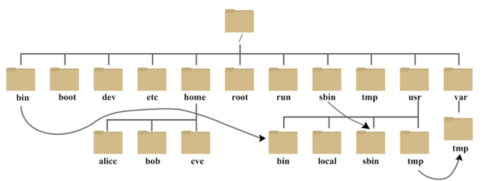

### 背景
Linux 是一种自由和开放源码的类 UNIX 操作系统。

Linux 英文解释为 `Linux is not Unix`。

Linux 是在 1991 由林纳斯·托瓦兹在赫尔辛基大学上学时创立的，主要受到 Minix 和 Unix 思想的启发。

本教程将为大家介绍常用Linux命令。

### Linux下的文件系统
在Linux下**没有**盘符的概念, 只有一个根目录`/`，所有文件都在根目录下（如下图）

以下仅介绍常见目录：
+ `/bin`: bin 是 Binaries (二进制文件) 的缩写, 这个目录存放着最经常使用的命令。
+ `/home`: 用户的主目录，在 Linux 中，每个用户都有一个自己的目录，一般该目录名是以用户的账号命名的，如上图中的 alice、bob 和 eve。
+ `/etc`: etc 是 Etcetera(等等) 的缩写,这个目录用来存放所有的系统管理所需要的配置文件和子目录。
+ `/root`: 该目录为系统管理员，也称作超级权限者的用户主目录。
+ `/opt`: 一般软件可存放在此目录下便于管理。

了解了根目录，接下来介绍**绝对路径与相对路径**

**绝对路径**： 最前面是 `/` 或者 `~`

+ `/` 表示从根目录开始
+ `~` 表示从家目录开始
> 例如： `/home/ljjtpcn/Desktop` 等价于 `~/ljjtpcn/Desktop`

**相对路径**： 最前面不是 `/` 和 `~`
+ `./`表示当前目录，通常可省略不写
+ `../`表示当前目录的上一级目录

### 逻辑运算符

